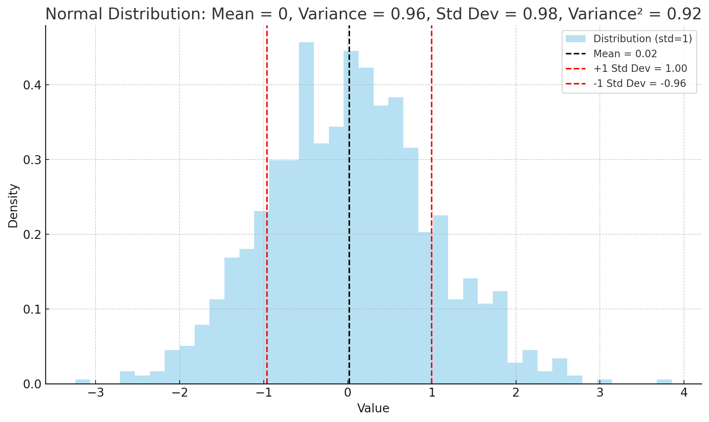

```python
# import required libraries after environment reset
import numpy as np
import matplotlib.pyplot as plt

# simulate a simple normal distribution
np.random.seed(42)
data = np.random.normal(loc=0, scale=1, size=1000)  # mean=0, std=1 → variance=1

mean = np.mean(data)
variance = np.var(data)
std_dev = np.std(data)
variance_squared = variance ** 2

# create the plot
fig, ax = plt.subplots(figsize=(10, 6))

# histogram of the data
ax.hist(data, bins=40, density=True, alpha=0.6, color='skyblue', label='Distribution (std=1)')

# mean and variance lines
ax.axvline(mean, color='black', linestyle='dashed', linewidth=1.5, label=f'Mean = {mean:.2f}')
ax.axvline(mean + std_dev, color='red', linestyle='dashed', linewidth=1.5, label=f'+1 Std Dev = {mean + std_dev:.2f}')
ax.axvline(mean - std_dev, color='red', linestyle='dashed', linewidth=1.5, label=f'-1 Std Dev = {mean - std_dev:.2f}')

# visualization
ax.set_title(f'Normal Distribution: Mean = 0, Variance = {variance:.2f}, Std Dev = {std_dev:.2f}, Variance² = {variance_squared:.2f}')
ax.set_xlabel('Value')
ax.set_ylabel('Density')
ax.legend()

plt.grid(True)
plt.tight_layout()
plt.show()
```


